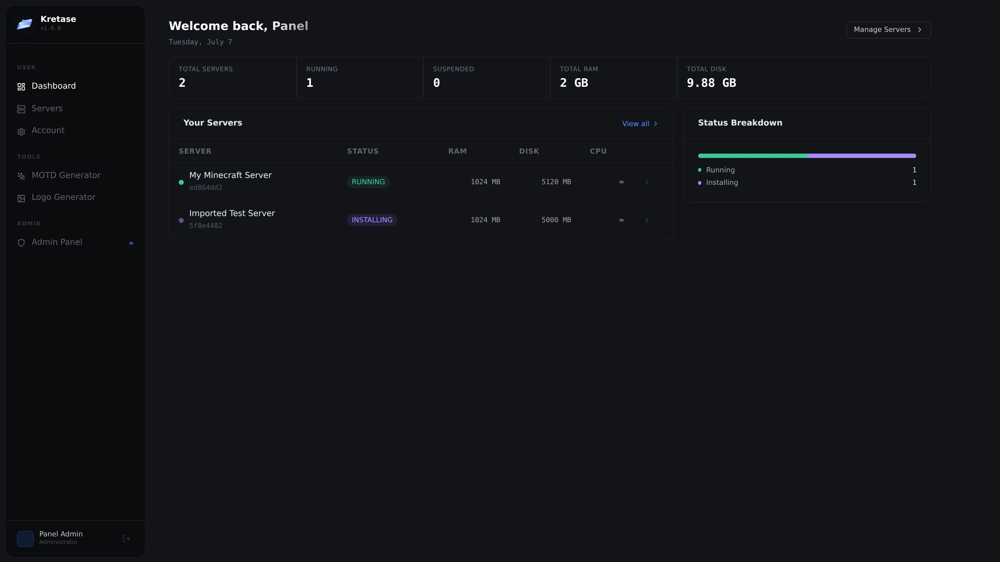
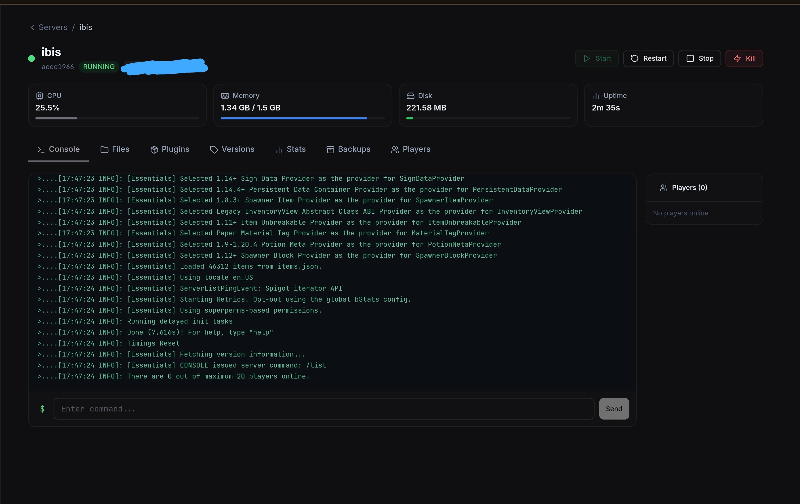
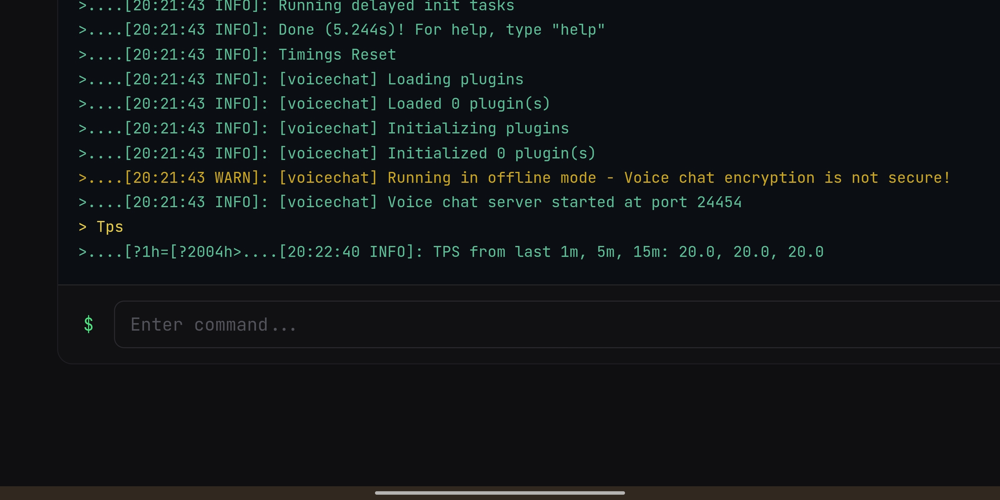
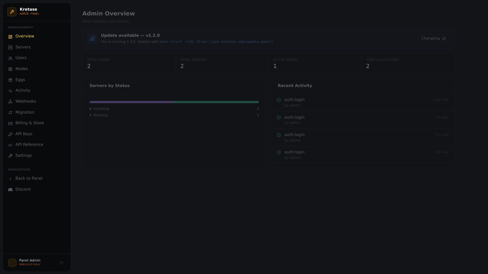

<div align="center">
  
</div>

## 🚀 v1.3.0 OUT NOW!

Cloud backup destinations (S3/B2/R2/Wasabi/Spaces/MinIO, SFTP, Google Drive), bidirectional Discord bot control (`/start`, `/stop`, `/restart` from Discord), a Pterodactyl migration wizard, an installable PWA with real crash/suspension push notifications, WHMCS/Blesta/Tebex/CraftingStore billing integrations, Discord login, a 299-egg community egg store, outbound webhooks, white-label theming, hCaptcha, a self-documenting API reference, and a **real SFTP server** in Wings (previously just a placeholder port). See the [full changelog](./CHANGELOG.md#v130) for every detail.

---

# Kretase

**Self-hosted, open-source game server management panel — a modern alternative to Pterodactyl.**


[](https://www.bestpractices.dev/projects/13482)
[](https://securityscorecards.dev/viewer/?uri=github.com/mwlih28/Mc-manage-panel)

> 🔥 **Real-world performance:** a Minecraft 1.20.1 server with simulation-distance 32 runs smoothly on just **1 CPU core and 1.5GB RAM** — Aikar's JVM flags and Kretase's built-in auto-optimization do the heavy lifting out of the box.

> ⚠️ **This project is under active development.** Core features work, but expect rough edges, breaking changes, and missing polish. Test in your own environment before relying on it for anything critical. Feedback and bug reports are very welcome.

> ✅ **What's actually been hardened:** a full security audit was run against the codebase, closing an API-key scope-enforcement gap across ~48 server/backup routes that had no scope check at all. Auth-sensitive endpoints (login, 2FA, password reset, SFTP login) are rate-limited. Passwords are bcrypt-hashed, sessions use short-lived JWTs with refresh rotation, admin API keys are scoped (not all-or-nothing) and stored as hashes, generic webhooks are HMAC-signed, and SFTP/file-manager access is chrooted per-server with path-traversal checks. None of this makes "under active development" untrue above — it means the parts that *are* done were done with real scrutiny, not left as an afterthought.

Manage Minecraft and other game servers from a web UI — with a Wings daemon on each node, real-time console, resource monitoring, and full admin controls.

---

## Screenshots


*User dashboard — server overview, resource stats*


*Real-time console with live output and command input*


*Live TPS output straight from the console — stable 20.0 across 1m/5m/15m*


*Separate admin panel — user/node/egg management*

---

## Why Kretase?

Pterodactyl is a great project, but it comes with real tradeoffs. Here's where this panel takes a different approach:

- **Modern stack, no PHP.** The frontend is React 18 + TypeScript, the backend is Express + Prisma. No Blade templates, no Laravel — easier to contribute to and extend.
- **Single-command install.** One `bash` command sets up the panel (Nginx, PostgreSQL, SSL) and another sets up Wings. Pterodactyl's install involves multiple manual steps across several guides.
- **Unified codebase.** Panel and Wings daemon live in the same monorepo. One `git pull` updates everything; no version drift between components.
- **Actively opinionated defaults.** Aikar's JVM flags pre-configured, sane resource limits out of the box, modern Docker images — sensible starting point without tuning everything manually.

> **Honest note:** Pterodactyl has years of production hardening, a large plugin ecosystem, and broader egg support. If you need that maturity today, use Pterodactyl. If you want a modern stack you can hack on, this is for you.

---

## One-command Install (Ubuntu / Debian)

### 1 — Install the Panel (on your panel server)

```bash
bash <(curl -fsSL https://get.kretase.com/panel)
```

The script will ask for:
- Your panel domain (e.g. `panel.yourdomain.com`) — point DNS before running
- Admin email, username, and password
- Whether to set up SSL with Let's Encrypt

After it finishes, open your domain in a browser and sign in.

### 2 — Install Wings (on each game server / node)

Run this on **every server** that will host game servers:

```bash
bash <(curl -fsSL https://get.kretase.com/wings)
```

The script will ask for:
- Your panel URL (e.g. `https://panel.yourdomain.com`)
- Node token — get this from **Admin → Nodes → your node** in the panel
- This server's public IP or FQDN
- Wings port (default: 8080)

### Supported OS

| OS | Versions |
|----|----------|
| Ubuntu | 20.04, 22.04, 24.04 |
| Debian | 11, 12 |

---

## Features

- **Server Management** — Create, start, stop, restart, kill game servers
- **Real-time Console** — Live server output + command input via WebSocket, with history replay on reconnect
- **Resource Monitoring** — CPU, RAM, disk stats streamed from Wings nodes, with persistent 1h/24h/7d history charts
- **Server Migration** — Move a server between nodes (all files, databases, everything) without recreating it — something Pterodactyl can't do
- **Server Cloning** — Duplicate a live server into a brand-new one without touching or stopping the original
- **Crash Auto-Restart** — Automatically restarts a server if its process exits unexpectedly (capped to prevent boot loops), toggleable per-server
- **Auto-Optimize on Lag** — Automatically clears dropped-item lag when CPU/memory stays critically high for a sustained period, toggleable per-server
- **Server Health Score** — A transparent 0–100 score from crash history, backup freshness, and CPU load, with a visible factor breakdown
- **Suspicious Activity Alarm** — Flags sensitive commands and command-spam (macro/script abuse) in real time
- **Player Leaderboard** — Sortable rankings (playtime, kills, deaths, blocks mined) from real per-player stats
- **Public Status Page** — Opt-in, no-login shareable page with online/player status, fully customizable (logo, animated banner, announcement, accent color, custom CSS) with a live preview editor
- **World Map** — A real top-down render of your world generated directly from the actual Minecraft region files, with radius/coordinate navigation
- **Plugin Manager** — Search, install, update, enable/disable Paper/Spigot/Bukkit plugins directly from Modrinth — no manual `.jar` uploads needed, and detects/updates unmanaged jars too
- **Mod Manager** — Same experience for Fabric mods, with automatic loader/Minecraft-version matching
- **One-Click Modpack Install** — Install a full CurseForge or Modrinth modpack (Fabric) in a single click
- **Version Manager** — Browse and switch Paper versions/builds with changelog view, downgrade protection, and an optional pre-install backup
- **World Manager** — Manage local worlds (switch active world, export/download, delete) and browse/install premade worlds (castles, mansions, and more) from CurseForge
- **Backup System** — Create and restore real server backups
- **Player Management** — Online/offline player list, ban/kick/IP-ban, inventory & ender chest viewer with real Minecraft item icons
- **EULA Consent Flow** — Server owner explicitly accepts/declines Mojang's EULA on first start
- **Scheduled Tasks** — Real cron-based power actions and console commands per server, with an in-game warning before scheduled restarts
- **Subuser Access Control** — Grant other users scoped access to a server
- **AI Tools** — MOTD and server logo generators; free built-in algorithm by default, optional real AI generation (OpenAI/Gemini/Anthropic) using the admin's own API key
- **Password Reset** — Self-service reset via the panel owner's own configured SMTP
- **User Management** — Admin and user roles, create/edit/delete users
- **Node Management** — Add Wings nodes, manage port allocations, one-command activation
- **Egg System** — Server configuration templates (Minecraft Paper, Bedrock, Vanilla, Fabric, BungeeCord, Velocity, and more)
- **Activity Log** — Full audit trail of panel actions
- **JWT Authentication** — Access + refresh token pair, secure bcrypt hashing
- **Real SFTP Access** — Direct file access per server, scoped to its own data directory, using your panel credentials
- **Outbound Webhooks** — Discord embeds or generic HMAC-signed JSON on server/user events, with per-webhook event filtering
- **Scoped API Keys** — Admin-issued keys with granular scopes (e.g. power-only, read-only) instead of all-or-nothing access
- **Cloud Backup Destinations** — Upload backups to S3-compatible storage, SFTP, or Google Drive, in addition to the local copy
- **Discord Bot Control** — `/start`, `/stop`, `/restart`, `/status` slash commands bound to a specific server
- **Pterodactyl Migration Wizard** — Pull servers (and their real files) from a source Pterodactyl panel over SFTP
- **Installable PWA + Push Notifications** — Install to a home screen/desktop; get a real OS notification on crash or suspension
- **Billing Integrations** — WHMCS/Blesta provisioning modules, Tebex/CraftingStore purchase webhooks
- **Discord Login (SSO)** and **hCaptcha** — Optional, off by default, configurable from Admin → Settings
- **Community Egg Store** — One-click import from a ~300-egg catalog (Minecraft, SteamCMD titles, voice servers, databases, and more)
- **White-Label Theming** — Custom CSS panel-wide and an option to hide panel attribution on public status pages
- **Multi-language UI** — English, Turkish, German, French, Spanish, Portuguese, Russian, and Chinese
- **Dark UI** — Modern responsive dark-themed interface

---

## How it works

```
[ Browser ]
     │  HTTPS
     ▼
[ Panel (Nginx) ]
     ├── /          → React SPA (static files)
     ├── /api/      → Express API  (port 3001)
     └── /socket.io → Socket.io    (port 3001)

[ Wings Daemon ] ← Panel API communicates over HTTP/WS
     └── Docker containers (one per game server)
```

The **Panel** is the web UI + API, installed once.  
**Wings** is a lightweight daemon installed on each machine that will run game servers. It manages Docker containers and streams console output back to the panel.

---

## After Installation

### First login
1. Go to `https://your-panel-domain.com`
2. Sign in with the admin credentials you set during install

### Add a node
1. **Admin → Nodes → New Node**
2. Fill in the FQDN / IP of your game server, port 8080, memory & disk limits
3. Copy the **Node Token** from the Configuration tab

### Connect Wings
1. SSH into your game server
2. Run the Wings install script (pasted above)
3. Enter the Panel URL and the token you just copied
4. Back in the panel, the node status should turn green

### Create a server
1. **Admin → Servers → New Server**
2. Pick a node, allocation, egg (e.g. Minecraft Paper), resource limits
3. Click Create — Wings downloads the egg and starts the container

---

## Updating

```bash
# On the panel server:
bash <(curl -fsSL https://get.kretase.com/update-panel)

# On each Wings node:
bash <(curl -fsSL https://get.kretase.com/update-wings)
```

Both scripts back up what needs backing up, pull the latest code, rebuild, and restart — your `.env`, `config.yml`, and database are left untouched. Run the Wings updater on every node after updating the panel, since panel releases sometimes ship new Wings-side functionality.

---

## Tech Stack

| Layer | Technology |
|-------|-----------|
| Frontend | React 18, TypeScript, Vite, Tailwind CSS |
| Backend | Express, TypeScript, Prisma ORM |
| Database | PostgreSQL |
| Real-time | Socket.io |
| Node daemon | Node.js + Dockerode |
| Auth | JWT + bcrypt |
| Proxy | Nginx |

---

## Development Setup

### Prerequisites
- Node.js 20+
- PostgreSQL (or Docker)

```bash
git clone https://github.com/mwlih28/mc-manage-panel.git
cd mc-manage-panel

# Install API deps
cd apps/api && npm install

# Configure
cp .env.example .env   # edit DATABASE_URL, JWT_SECRET, etc.

# Apply schema + seed
npx prisma db push
npx ts-node src/utils/seed.ts

# Start API (port 3001)
npm run dev
```

```bash
# In another terminal — start web (port 5173)
cd apps/web && npm install && npm run dev
```

---

## Environment Variables

### API (`apps/api/.env`)

| Variable | Required | Description |
|----------|----------|-------------|
| `DATABASE_URL` | yes | PostgreSQL connection string |
| `JWT_SECRET` | yes | JWT signing secret (32+ chars) |
| `JWT_REFRESH_SECRET` | yes | Refresh token secret (32+ chars) |
| `CORS_ORIGIN` | yes | Panel URL for CORS |
| `PORT` | no | API port (default `3001`) |

### Web (build-time)

| Variable | Description |
|----------|-------------|
| `VITE_API_URL` | Full API URL — leave empty for same-domain nginx proxy |

---

## Documentation

Full guides live in [`docs/`](./docs):

- **[Installation](./docs/installation.md)** — detailed install/update/uninstall walkthrough, troubleshooting
- **[Eggs](./docs/eggs.md)** — writing server templates, importing from Pterodactyl, the community egg store
- **[SFTP Access](./docs/sftp.md)** — connecting to a server's files over SFTP
- **[API Guide](./docs/api.md)** — authentication, scopes, and the full endpoint reference (also browsable live in-app at **Admin → API Reference**)

---

## Roadmap

Everything that used to be listed here (2FA, Discord notifications, multi-language UI, billing/subscriptions, a bigger egg catalog) has since shipped — see the [changelog](./CHANGELOG.md) for the full history. Known gaps, honestly stated:

- [ ] **Subuser permission enforcement** — subuser access grants are stored per-server, but no access path (console, file manager, SFTP, backups) actually checks them yet — a subuser currently gets the same access as the owner, or none, not the specific permissions granted. Tracked as the next security-relevant gap to close.
- [ ] **Broader non-Minecraft game support** — the community egg store already covers a wide range of SteamCMD titles and services, but Minecraft is still where the most polish (world map, player stats, plugin/mod managers) is concentrated.

Contributions on either front are welcome — see below.

---

## Contributing

Contributions are welcome. Here's the flow:

1. **Open an issue first** for anything non-trivial — describe the problem or feature so we can align before you spend time coding.
2. Fork the repo and create a branch: `git checkout -b feat/your-feature`
3. Make your changes, keep commits focused and descriptive.
4. Open a pull request against `main`. Link the related issue in the PR description.

For bug reports, include your OS, Node version, and relevant logs. For feature requests, explain the use case.

**Testing:** new functionality should come with tests where practical (`npm test` in `apps/api` or `apps/web`, both run via [Vitest](https://vitest.dev)). CI runs the full suite — type-check, tests, and build — on every pull request.

---

## VIRUSTOTAL

Install-panel.sh : https://www.virustotal.com/gui/file/46c5af7da89b7968dcf68e2bf6d81303ba4ceeff5b83492ceec287218aed573a

Install-wings.sh : https://www.virustotal.com/gui/file/a06dc0493715a3677a373157b8c27a9569a116aefeb1fa30132ec3ad4183512c

---

## Contact

Got an idea, found a bug, or just want to reach out? Email: **mwlih28@gmail.com**

---

## Acknowledgments

Email delivery uses [Resend](https://resend.com) — thanks for letting us use their name and mark. This is not an official or approved Resend integration.

---

## Star History

[](https://star-history.com/#mwlih28/mc-manage-panel&Date)

---

## License

MIT
